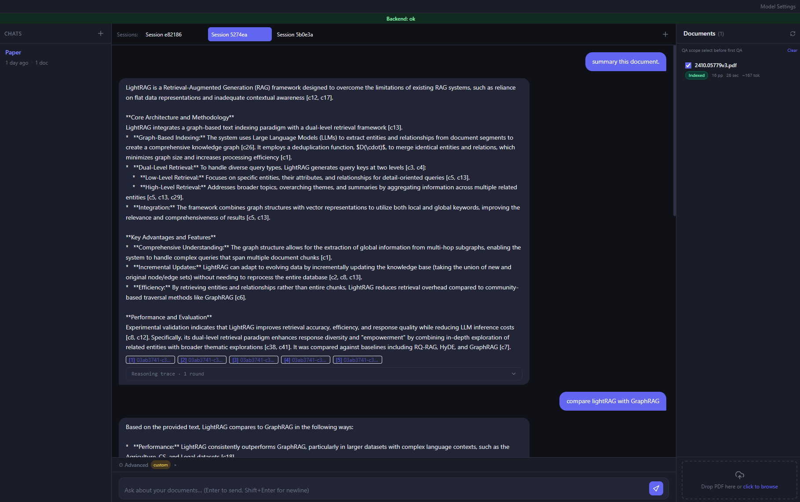
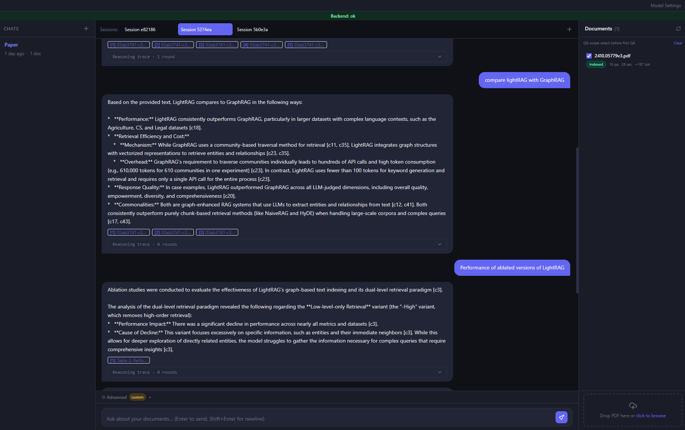
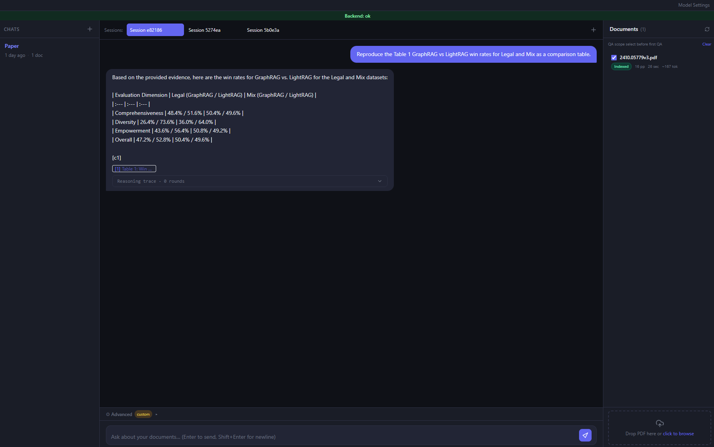
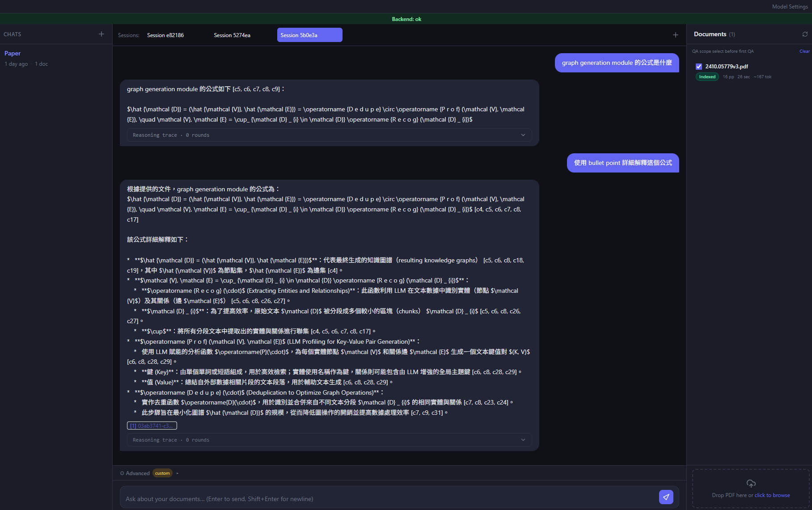

# Paper Notebook Agent

A NotebookLM-like multi-document Agentic QA system targeting arXiv research papers. Upload PDFs to a Chat, the system parses + indexes them, and a LangGraph agent answers questions over **that chat's documents only**, with citations back to the original pages.

> Architecture contract: [`CLAUDE.md`](CLAUDE.md) (English, normative).
> Phased development plan: [`DEVELOPMENT_PLAN.md`](DEVELOPMENT_PLAN.md) (zh-Hant).
> Live progress + decisions: [`PROGRESS.md`](PROGRESS.md) (zh-Hant).
> Original spec: [`GUIDE.md`](GUIDE.md).
> Final delivery report: [`artifacts/final-report.md`](artifacts/final-report.md).
> Subsystem docs (English):
> [`docs/01-mineru-setup.md`](docs/01-mineru-setup.md) ·
> [`docs/02-mineru-output-customizations.md`](docs/02-mineru-output-customizations.md) ·
> [`docs/03-postgresql-schema.md`](docs/03-postgresql-schema.md) ·
> [`docs/04-vespa-schema.md`](docs/04-vespa-schema.md) ·
> [`docs/05-agent-workflow.md`](docs/05-agent-workflow.md) ·
> [`docs/06-architecture.md`](docs/06-architecture.md) ·
> [`docs/07-qa-pipeline.md`](docs/07-qa-pipeline.md) ·
> [`docs/08-deep-qa.md`](docs/08-deep-qa.md).

---

## 1. Highlights

- **Multi-Chat isolation**: every document, retrieval, citation and SQL query is bound to `chat_id`. Cross-chat reads are rejected at four independent layers (DB, Vespa filter, API scope, service layer).
- **MinerU hybrid parsing**: arXiv PDFs flow through MinerU's VLM (running on a local vLLM at `http://localhost:8001`) producing reliable markdown + a structured `middle.json`; the post-processor renames image crops and adds page anchors.
- **Vespa hybrid retrieval**: BM25 + HNSW ANN candidates → RRF fusion → optional Vespa native or cross-encoder reranker. Every query forcibly injects `chat_id`.
- **LangGraph StateGraph**: explicit 16-node graph (incl. bounded `llm_replan`), 8 tools (incl. deterministic `grep_document_chunks`), 15 code-enforced policies; tool `chat_id` is **always** injected from `AgentState`, never from the LLM.
- **Deep QA mode**: per-message opt-in that widens retrieval (`preset=broad`, top_k=20, larger grep window), bumps the default answer budget to 32 768 / context window to 200 000, ignores the soft `aggregate_sources` overflow path, and injects same-session memory into the answer prompt — without weakening chat isolation. See [`docs/08-deep-qa.md`](docs/08-deep-qa.md).
- **Per-session document scope**: a chat can hold many PDFs but a session can pin a subset on its first message; the backend then locks `selected_document_ids` so subsequent turns never silently widen scope.
- **Goal coverage score: 100/100** with every mandatory gate passing — see `artifacts/evaluation/goal-score.md`.

### Demo screenshots

Normal mode — single-turn citations over an arXiv PDF:





Deep QA mode — multi-turn follow-up where the agent resolves "前一個問題的方法" against same-session memory (see [`docs/08-deep-qa.md`](docs/08-deep-qa.md)):



---

## 2. Tech stack

| Layer | Tech |
|---|---|
| Language / runtime | Python 3.12+ (entire pipeline via `uv`) |
| Backend | FastAPI, Uvicorn, Pydantic v2, SQLAlchemy 2.x, Alembic |
| Agent | LangGraph + LangChain Core |
| Storage | PostgreSQL (Alembic-managed schema) |
| Parsing | MinerU 3.3+ hybrid backend (vLLM-backed OpenAI-compatible VLM) |
| Search | Vespa 8 + pyvespa (BM25 / HNSW ANN / hybrid / multi-stage rerank) |
| Providers | OpenAI, Gemini Native + OpenAI-compatible, self-hosted vLLM |
| Frontend | Next.js 15 (App Router), React 19, TypeScript, Tailwind 3, TanStack Query v5 |
| Tests | pytest + pytest-asyncio (backend), vitest (frontend) |
| Quality | ruff, mypy, vitest, tsc, Next.js lint |

---

## 3. Repository layout

```
.
├── CLAUDE.md                      # architecture contract (English, normative)
├── DEVELOPMENT_PLAN.md / PROGRESS.md / GUIDE.md
├── src/
│   ├── app/                       # backend (import root = `app`)
│   │   ├── api/                   # FastAPI routers (thin)
│   │   ├── agent/                 # LangGraph state, nodes/, tools/, policies, budget, graph
│   │   ├── parsing/               # MinerU client + mapping → ParsedBlock / hierarchy
│   │   ├── enrichment/            # summaries, keywords, claims, facts, manifest
│   │   ├── retrieval/             # RetrievalService (single Vespa entry-point)
│   │   ├── vespa/                 # app package, feed, encoders, mock
│   │   ├── providers/             # chat/embedding/reranker adapters (+ deterministic mocks)
│   │   ├── services/              # chat / session / document / ingestion / qa / facts
│   │   ├── models/                # ORM + Pydantic v2 domain models
│   │   └── evaluation/            # parser, retrieval, QA, goal-score harnesses
│   └── frontend/                  # Next.js 15 App Router (Chat / Documents / Sessions / Settings)
├── data/                          # fixtures (committed) + parsed cache + storage (gitignored)
├── deploy/                        # docker-compose, vespa application package, mineru wrapper docs
├── migrations/                    # Alembic env + versions
├── scripts/                       # MinerU PoC, deploy_vespa, ingest_sample_arxiv, eval/score runners
├── tests/                         # unit/ integration/ e2e/ evaluation/ fixtures/
└── artifacts/                     # repair-loop iterations + evaluation reports
```

Backend import root: `app` (under `src/app/`). All Python commands run from repo root via `uv`.

---

## 4. Quick start

### 4.1 Prerequisites

- `uv` ≥ 0.4 — installer: <https://docs.astral.sh/uv/>
- Docker Engine + Compose v2 (for Vespa + Postgres dev stack)
- A local MinerU server (uses your own vLLM @ `http://localhost:8001`; see `deploy/mineru/README.md`)
- Node.js 20+ for the frontend (Next.js 15)

### 4.2 First-time setup

```bash
uv sync                                          # install Python deps from uv.lock
docker compose -f deploy/docker-compose.yml up -d postgres vespa
uv run alembic upgrade head                      # create DB schema
cp .env.example .env                             # then edit if needed
uv run uvicorn app.main:app --reload             # http://localhost:8000
npm --prefix src/frontend install
npm --prefix src/frontend run dev                # http://localhost:3000
```

### 4.3 Parse a sample PDF (Phase 1 PoC sanity check)

```bash
uv run python scripts/ingest_sample_arxiv.py     # downloads a small arXiv paper
uv run python scripts/mineru_poc.py              # hybrid-http-client → data/parsed/
```

### 4.4 Containerized startup (full stack via Docker Compose)

The whole stack (Postgres + Vespa + FastAPI backend + Next.js frontend) is
buildable from `deploy/docker-compose.yml`. Each service has its own image:

| Service | Image | Source |
|---|---|---|
| `postgres` | `postgres:16-alpine` | upstream |
| `vespa` | `vespaengine/vespa:8` | upstream |
| `backend` | `paper-notebook-agent/backend:latest` | `deploy/backend/Dockerfile` (multi-stage, uv-managed) |
| `frontend` | `paper-notebook-agent/frontend:latest` | `deploy/frontend/Dockerfile` (Next.js 15 standalone) |

#### Prerequisites

- Docker Engine ≥ 24 and Docker Compose v2.
- A running **MinerU-compatible vLLM** on the host at `http://localhost:8001`
  (see `deploy/mineru/README.md`). The backend container reaches it via
  `host.docker.internal:8001` (mapped automatically through `extra_hosts`).
- (Optional) a real LLM endpoint for generative answers — pass it through the
  `LLM_*` env vars (see below). If absent, QA falls back to an extractive,
  evidence-only answer instead of a mock response.

#### Build + start everything

```bash
# From repo root (the compose file's build context is the repo root):
docker compose -f deploy/docker-compose.yml build
docker compose -f deploy/docker-compose.yml up -d

# Tail the logs of the app services
docker compose -f deploy/docker-compose.yml logs -f backend frontend
```

On first start the backend container automatically runs
`alembic upgrade head` against the `postgres` service before booting Uvicorn.
Healthchecks gate the start order (`postgres` → `backend` → `frontend`).

When all four services are healthy:

- Frontend UI: <http://localhost:3010>
- Backend API + OpenAPI docs: <http://localhost:9010/docs>
- Vespa config / query endpoints: <http://localhost:19072>, <http://localhost:8089>
- Postgres: `localhost:5433` (user `postgres`, db `paper_notebook`)

#### Configuration (override via shell env or a `.env` next to compose)

| Variable | Purpose | Default |
|---|---|---|
| `APP_ENCRYPTION_KEY` | Fernet key for encrypting provider credentials. **Set this for any real use.** | `dev-only-change-me-32-bytes-base64` |
| `MINERU_SERVER_URL` | MinerU hybrid VLM endpoint. | `http://host.docker.internal:8001` |
| `VESPA_ENDPOINT` | Backend-to-Vespa query/feed endpoint. | `http://vespa:8080` |
| `EMBEDDING_DIM` | Vespa native E5 tensor dimension. Keep at `384` unless you also change the Vespa embedder model/schema. | `384` |
| `LLM_PROVIDER` | `mock` / `openai_compatible` / `openai` / `gemini_native`. | `mock` |
| `LLM_API_URL` / `LLM_MODEL` / `LLM_API_KEY` | Env-level fallback LLM used when a chat has no `default_chat_profile`. | empty |
| `LLM_CONTEXT_WINDOW` | Context budget in tokens (Deep QA mode bumps the per-request default to 200 000). | `10000` |
| `LLM_MAX_TOKENS` | Default cap on the answer's output tokens (Deep QA mode bumps the per-request default to 32 768). | `2048` |
| `LLM_TEMPERATURE` | Default sampling temperature. | `0.0` |
| `NEXT_PUBLIC_API_BASE_URL` | Optional build-time absolute backend URL. Empty means the browser uses the frontend `/api/proxy` route. | empty |
| `CORS_EXTRA_ORIGINS` | Comma-separated extra browser origins the backend will accept. | `http://localhost:3010,http://127.0.0.1:3010` |

> If you expose the stack on a domain other than `localhost`, rebuild the
> frontend image with the right base URL — Next inlines public env vars at
> build time:
> ```bash
> NEXT_PUBLIC_API_BASE_URL=https://api.example.com \
>   docker compose -f deploy/docker-compose.yml build frontend
> ```

#### One-shot deploy of the Vespa application package

The `vespa` container ships empty. After it's healthy, push the schema:

```bash
uv run python scripts/deploy_vespa.py --config-url http://localhost:19072
```

(You can also run the same script from inside the backend container with
`docker compose exec backend uv run python scripts/deploy_vespa.py`.)

#### Upload a PDF and ask a question from the UI

Once the stack is up and the Vespa schema deployed:

1. Open <http://localhost:3000>.
2. **Settings → Providers** — register a Chat profile (or rely on the
   env-level `LLM_*` fallback) if you want real LLM answers. Embedding and
   rerank do **not** require user profiles; Vespa computes them with the
   bundled native E5 embedder.
3. **Chats → New chat** — every chat is its own isolation boundary
   (CLAUDE.md §2). Pick a default chat profile.
4. Inside the chat, **Documents → Upload**, drop in an arXiv PDF. The
   backend streams it through MinerU (hybrid client → vLLM @ host:8001),
   parses `middle.json` into `ParsedBlock`s, runs enrichment, and feeds
   chunks into Vespa under that `chat_id`; Vespa computes document embeddings
   during indexing.
5. When ingestion shows "ready", open the **Chat** pane and ask a question.
   The LangGraph agent will retrieve only over this chat's documents and
   stream the answer over SSE, with citations back to the source pages.
6. For long synthesis questions or session follow-ups, expand
   **⚙ Advanced** under the chat input and tick **Deep QA mode** before
   sending — the agent will widen retrieval, ignore the soft budget, and
   prepend recent same-session turns to the answer prompt. Full
   behaviour: [`docs/08-deep-qa.md`](docs/08-deep-qa.md).

#### Stop / reset

```bash
docker compose -f deploy/docker-compose.yml down            # stop, keep data
docker compose -f deploy/docker-compose.yml down -v         # also drop volumes
```

The `backend_data` volume holds uploaded PDFs (`/app/data/storage`) and
MinerU output cache (`/app/data/parsed`); the `postgres_data` and
`vespa_data` volumes hold their respective database state.

---

## 5. Evaluation harnesses & reports

All harnesses are deterministic and run without paid APIs.

```bash
# Parser evaluation (LightRAG golden corpus)
uv run python scripts/run_parser_eval.py
# → artifacts/evaluation/parser-report.{json,md}

# Retrieval evaluation (5 modes, leakage check)
uv run python scripts/run_retrieval_eval.py
# → artifacts/evaluation/retrieval-report.{json,md}

# Golden QA evaluation (GUIDE §19, 7 case kinds)
uv run python scripts/run_qa_eval.py
# → artifacts/evaluation/qa-report.{json,md}

# Goal coverage score (GUIDE §21) — depends on the three above
uv run python scripts/run_goal_score.py
# → artifacts/evaluation/goal-score.{json,md}
```

Current results (this commit):

| Report | Result |
|---|---|
| Parser eval | LightRAG `2410.05779v3`: gate PASS (heading-F1=0.33, math-recall=1.0, refs=21, figs=6, tables=6) |
| Retrieval eval | 5 modes; all `recall@10=1.0`; **leakage=0** in every mode; rerank does not regress nDCG |
| Golden QA | **7/7 cases pass**; cross-chat refusal verified |
| Goal coverage | **100/100**, mandatory gates all PASS |

---

## 6. Isolation contract (CLAUDE.md §2)

Four layers — none may be skipped:

1. **DB query** — every document-scoped table carries `chat_id`; service-layer queries always include `WHERE chat_id = :current_chat_id`.
2. **Vespa filter** — `RetrievalService._yql_where` injects `chat_id contains "<current>"` before any user-supplied filter; the YQL builder is the only public Vespa entry point.
3. **API scope** — route layer verifies session/document ownership via `session_service` / `document_service`; cross-chat URLs return 404.
4. **Agent layer** — `chat_id` lives in `AgentState` and is propagated to tools by the service layer; tool parameter schemas use `extra="forbid"` and do **not** include `chat_id`, so the LLM cannot inject it.

Citations are checked twice: `PolicyEngine.enforce_citations` drops drafts whose `chat_id != state.chat_id` (policy 12) and whose `document_id` is not in the `ChatDocument` association (policy 13). The bounded LLM replan path (`llm_replan` node) is fenced by policy 15 — the LLM can only nominate whitelisted retrieval tools and never sees `chat_id` in its schema.

---

## 7. Provider settings

Chat, embedding and reranker profiles are independent. Supported provider types:

- OpenAI (`gpt-*` etc.)
- Gemini Native (Google GenAI SDK)
- Gemini OpenAI-compatible
- Generic OpenAI-compatible (vLLM, OpenRouter, etc.)

API keys are encrypted at rest via Fernet (`APP_ENCRYPTION_KEY`) — never logged, never returned to the frontend (masked everywhere). Connection-test endpoints validate model+latency and return sanitised error strings.

For demo without a DB row, env-level fallback variables (`LLM_PROVIDER` / `LLM_API_URL` / `LLM_MODEL` / `LLM_API_KEY`) build a `OpenAICompatChatProvider` on the fly — see `scripts/smoke_agent_e2e.py` for an end-to-end demo.